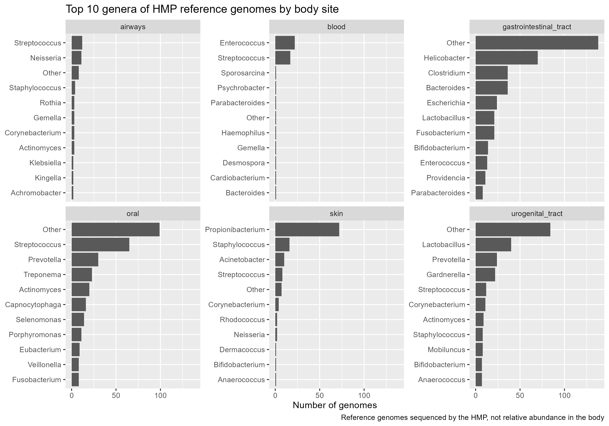
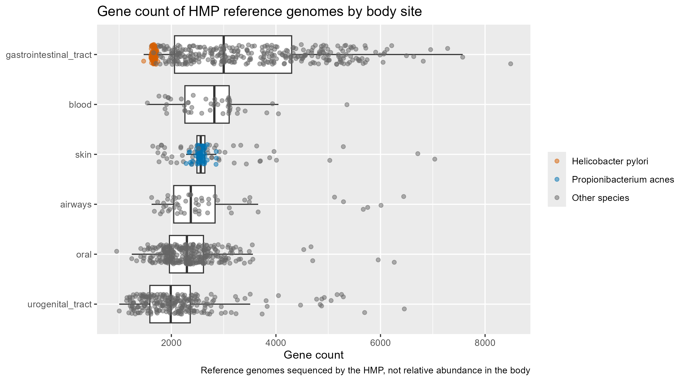
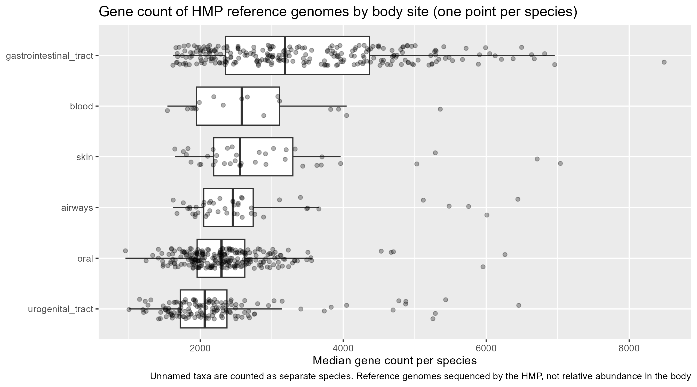

# HMP body-site genomes

Which microorganisms, and with how many genes, did the Human Microbiome Project sequence at each site of the human body?



## Question

The HMP Project Catalog lists the reference genomes sequenced by the Human Microbiome Project, with the body site each strain was isolated from. This project asks:

1.  **Which organisms** (genera and species) were sequenced at each body site?
2.  **How large are their genomes**, measured as gene count, and does that differ between sites?

## Key findings

- **Each site has a clear dominant genus**: *Helicobacter* in the gastrointestinal tract, *Streptococcus* in the oral cavity and airways, *Propionibacterium* on the skin, *Lactobacillus* in the urogenital tract and *Enterococcus* in blood.
- **A few species take up a large share of the catalog**: *Propionibacterium acnes* (71 genomes), *Helicobacter pylori* (63) and *Escherichia coli* (59).
- **Gastrointestinal genomes have the most genes and urogenital genomes the fewest.** The ordering holds whether each strain or each species is counted once.
- **Counting strains hides real variability.** On the skin, the interquartile range of gene count is about 160 genes when every strain counts, but about 1,170 when each species counts once: dozens of near-identical *P. acnes* genomes flatten the distribution.

## Data {#data}

| Field | Value |
|------------------------------------|------------------------------------|
| File | `data/raw/project_catalog.csv` (2,915 rows, 17 columns) |
| Downloaded from | [Kaggle: The Human Microbiome Project](https://www.kaggle.com/datasets/bbhatt001/human-microbiome-project) (user bbhatt001) |
| Original source | [Human Microbiome Project](https://hmpdacc.org/), funded by the NIH |
| Terms of use | License listed as *Unknown* on Kaggle. The HMP data are publicly available to the community free of charge ([AWS Registry of Open Data](https://registry.opendata.aws/human-microbiome-project/)) |
| Download date | 2026-10-04 |

The raw file is kept exactly as downloaded. It uses old Mac (`CR`) line endings, so Git treats it as a binary file.

## Methods

### Cleaning (`R/01_clean.R`)

| Decision | Why |
|------------------------------------|------------------------------------|
| Keep 6 columns: organism, domain, superkingdom, body site, gene count, NCBI Project ID | The rest are not used. The NCBI ID is kept to link each genome to NCBI |
| `"Error!!!"` and empty cells are read as missing | Junk values in the raw file |
| Drop a row only if **both** domain and superkingdom are missing | Requiring both would drop 112 valid bacteria that only have superkingdom |
| Drop gene count = 0 | A 0 means "not reported", not a genome without genes |
| Drop *Prevotella pleuritidis* F0068 (NCBI 72901) | 51 genes vs. thousands expected for a free-living bacterium: likely an incomplete record |

Result: **1,506 genomes**, validated against an independent Python run.

### Taxonomy (`R/02_add_taxonomy.R`)

| Column | Rule |
|------------------------------------|------------------------------------|
| `genus` | First word of the organism name. Missing if it ends in *-aceae* (family), *-ales* (order) or *-etes* (phylum): 36 genomes |
| `species` | Genus + second word. Missing if there is no genus, or if the second word is *sp.*, *bacterium*, *genomosp.* or *oral* (as in "oral taxon 274"): 290 genomes |

### Analysis (`R/03`–`R/05`)

- Genomes with body site `unknown` are excluded, as are sites with 2 genomes or fewer (heart, liver, lymph nodes, nose). Six sites remain.
- Genus and species plots show the top 10 per site. Ties are broken alphabetically, so the result is reproducible. The species plot only includes species with at least 2 genomes in that site.
- Gene count plots exclude the 2 archaea, and are drawn twice: once per strain (1,180 genomes) and once per species (752 species; each species is its median gene count, and unnamed taxa count as separate species).

## Figures

**Gene count by body site, one point per strain.** *H. pylori* and *P. acnes* are highlighted: their many near-identical strains pull and narrow the distributions.



**Same data, one point per species.** Each species weighs the same; the skin box widens a lot.



Also available: [top 10 species by site](figures/species_by_site.png) and [top 10 genera with the rest grouped as "Other"](figures/genus_by_site_other.png).

## Limitations

- **This is not abundance.** The catalog lists what the HMP chose to sequence, mostly cultivable organisms, often of clinical interest. A genus with many genomes is well covered by reference databases, not necessarily common in the body.
- **Gene count is a proxy for genome size.** In bacteria it tracks genome length closely (about 1 gene per kb), but it is not size in base pairs.
- **Draft genomes** may slightly underestimate gene count. Assembly status is not used yet.
- **318 genomes (21%) have an unknown body site** and are left out.

## How to reproduce

Requires R (developed with R 4.5.1).

``` bash
git clone https://github.com/FranDuclos/hmp-body-site-genomes.git
```

Open `hmp-body-site-genomes.Rproj` in RStudio, then in the R console:

``` r
renv::restore()    # installs the exact package versions used
source("main.R")   # runs the whole pipeline: data/processed/ and figures/
```

## Project structure

```         
hmp-body-site-genomes/
├── main.R                   # runs the full pipeline
├── R/
│   ├── 01_clean.R           # raw catalog -> clean table
│   ├── 02_add_taxonomy.R    # adds genus and species
│   ├── 03_plot_genus.R      # top 10 genera per site
│   ├── 04_plot_species.R    # top 10 species per site
│   └── 05_plot_gene_count.R # gene count per site
├── data/
│   ├── raw/                 # original data, never modified
│   └── processed/           # generated by the scripts (not tracked)
├── figures/                 # generated plots
└── renv.lock                # package versions
```

## Next steps

- **Interactive Shiny app**: click a body site on a human silhouette to see its organisms, their gene counts and links to NCBI.
- **Real genome size** in base pairs, retrieved from NCBI with `rentrez`.
- **Phylum-level summary**, using an external taxonomy table.
- **Abundance vs. reference coverage**: combine this catalog with HMP abundance data (`HMP16SData`) to find taxa that are abundant in the body but have few reference genomes.

## License

Code: [MIT](LICENSE.md) © Francisco Duclos. Data: terms of the original source (see [Data](#data)).
